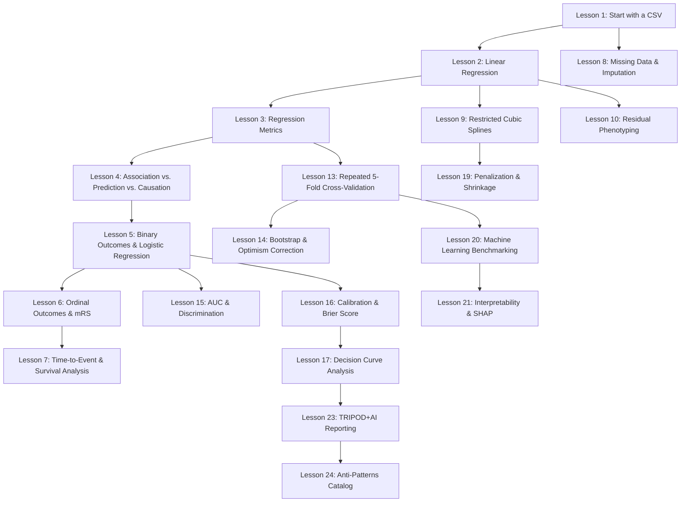

# Learning Architecture — Clinical Concepts Explainer

## 1. Primary Pedagogical Model: The 17-Step Core Discovery Sequence

Every lesson and concept follows this non-negotiable progression:

```text
 1. CLINICAL QUESTION           ("Does admission stroke severity predict final tissue death?")
        ↓
 2. WHY PROBLEM EXISTS          (Why clinical examination alone is insufficient)
        ↓
 3. GUESS BEFORE REVEAL         (Ask learner to predict relationship or sign)
        ↓
 4. INTERACTIVE VISUAL LAB      (Manipulate sliders, dots, knots, or folds)
        ↓
 5. PLAIN-ENGLISH EXPLANATION   (Explain what just moved in everyday language)
        ↓
 6. INTRODUCE FORMAL TERM       ("This vertical distance is called the residual")
        ↓
 7. MEDICAL APPLICATION         (Acute ischemic stroke, thrombectomy, perfusion CT)
        ↓
 8. EQUATION & SYMBOL BREAKDOWN (Term-by-term annotation of every symbol)
        ↓
 9. PYTHON CODE BLOCK           (Reproducible clinical code snippet)
        ↓
10. TOKEN-BY-TOKEN BREAKDOWN    (Granular line-by-line explanation for non-coders)
        ↓
11. SAMPLE OUTPUT DISPLAY       (Terminal or DataFrame printout)
        ↓
12. PLAIN-ENGLISH OUTPUT INTERPRETATION ("Our model underpredicted tissue death by 18 mL")
        ↓
13. "WHY DO I CARE?" CALLOUT    (Clinical implications for patient outcomes)
        ↓
14. COMMON TRAP / MISCONCEPTION (Prevent dangerous clinical or statistical errors)
        ↓
15. KNOWLEDGE CHECK QUIZ        (Immediate active recall with explanatory feedback)
        ↓
16. "GO DEEPER" EXPANSION       (Optional mathematical rigor for advanced learners)
        ↓
17. NARRATIVE BRIDGE            (Why the next lesson is logically necessary)
```

---

## 2. Concept Dependency Graph



---

## 3. Teaching Modes: Learn Mode vs. Live Demo Mode

| Feature | **Learn Mode (Default)** | **Live Demo Mode (Presentation)** |
| :--- | :--- | :--- |
| **Target Audience** | Solo medical student / researcher learning from zero | Clinician presenting findings on rounds / screenshare |
| **Content Depth** | Everyday analogies, guess-before-reveal, code tokens, quizzes | Research question, clean code, output, one-sentence takeaway |
| **Pacing** | Self-directed, interactive discovery, micro-steps | High-level, streamlined, speaker notes enabled |
| **State Storage** | `localStorage` tracks quiz completions and widget progress | Zero distraction, presentation-ready layout |

---

## 4. Reusable Pedagogical Component Blueprints

1. **`PredictBeforeReveal`**:
   - Presents a multiple-choice hypothesis prompt.
   - Disables options upon selection and transitions smoothly into the explanation with a colored feedback pill.
2. **`TokenCodeBlock`**:
   - Syntax-highlighted code container.
   - Clicking or hovering over tokens (e.g., `import`, `pd`, `read_csv`) reveals a tooltip/card explaining what that specific token does.
3. **`WhyCareBox`**:
   - Editorial card with an anchor icon and callout emphasizing why the statistical metric directly alters clinical prognosis or triage.
4. **`CommonTrapCard`**:
   - Two-column comparative card: "⚠️ Common Misconception" vs. "✅ Correct Clinical Understanding".
5. **`KnowledgeCheck`**:
   - Dynamic assessment with instant evaluation, randomized distractors, and clinical rationale.
